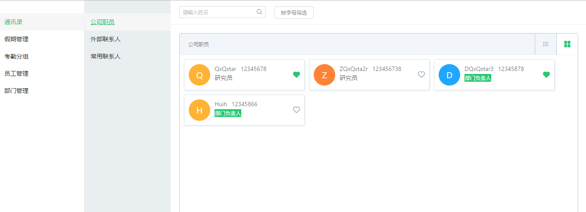
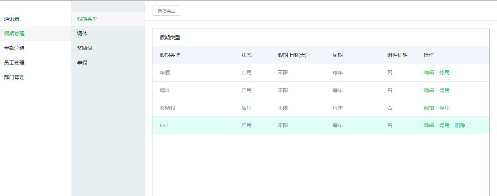
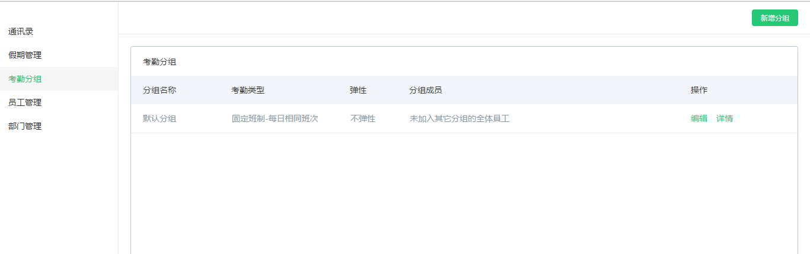
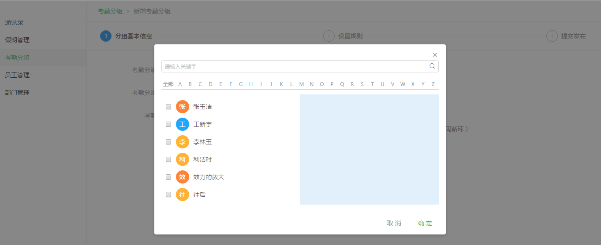
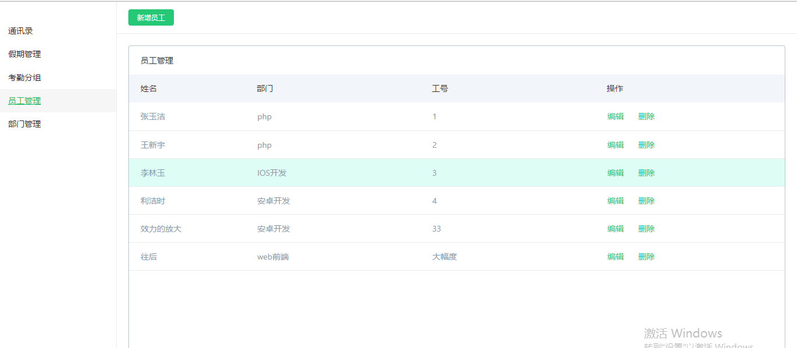
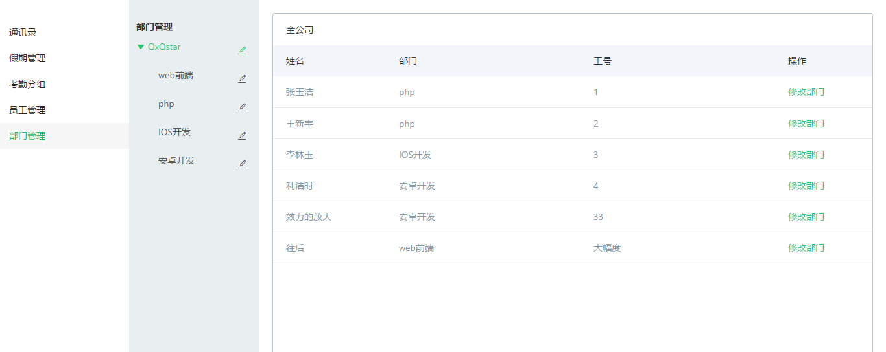

## 安装
> 进入my-app目录，然后在命令行中输入npm install
## 运行
> 在my-app目录下，npm start
## 注意
> 由于这个demo接入了数据库mongodb，所有要安装mongodb才能运行完整的功能!!!(员工管理和部门管理中用到了数据库)。安装了mongodb还需要启动
  mongodb
> 还有很多不足的地方会持续改进
## 技术栈
* React v15.6.2
* react-redux
* redux
* react-router-dom
* webpack
* nodeJs
* mongodb
* axios
## 项目架构
```
.
├─ exampleImg/                  # 截图
├─ note/                        # 学习笔记
├─ my-app/                      # 源码目录（开发都在这里进行）
│   ├─ config/                  # 服务配置文件
|   |── controller              # 处理网络请求
│   ├─ model/                   # mongoose Model
│   ├─ route/                   # nodeJs 路由配置
│   ├── schema/                 # mongoose Schema
│   ├── scripts/                # 启动服务的文件
│   ├── src/                    # react代码从这里开始
│   │   ├─ components/          # 全局组件
│   │   ├─ css/                 # 全局css样式
|   |   |── global/             # 全局方法
|   |   |── pages/              # 页面
|   |   |     |── att/          # 考勤分组模块
|   |   |     |── attendance/   # 通讯录模块
|   |   |     |── department/   # 部门管理模块
|   |   |     |── holiday/      # 假期管理
|   |   |     |── member/       # 员工管理
|   |   |── router/             # router
|   |   |── store/              # redux
|   |   |── App.css
|   |   |── App.js
|   |   |── index.css
|   |   |── index.js            # 入口
```

## 学习笔记
> 关于react的学习笔记都在note文件夹下面，[如果要看整理之后的笔记可以移步我的博客]: http://www.cnblogs.com/QxQstar/
## 截图
> 通讯录

> 假期管理

> 考勤分组

> 选择人员

> 员工管理

> 部门管理

